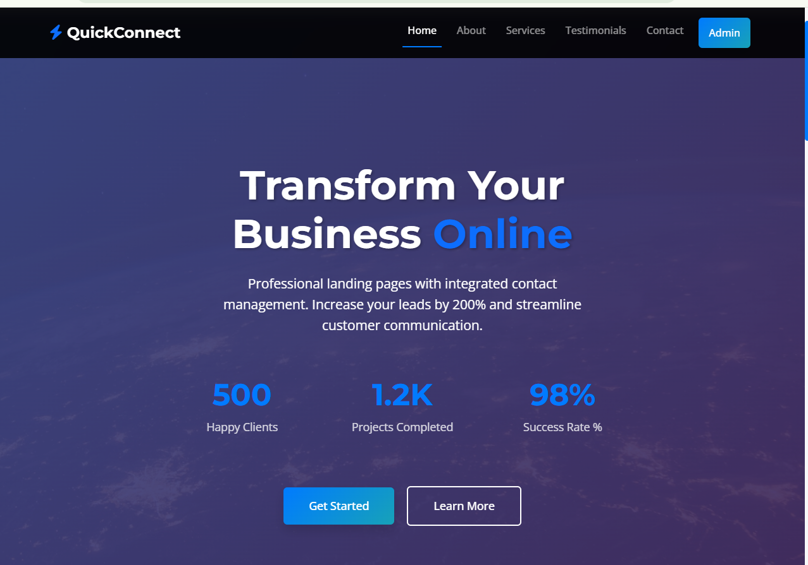
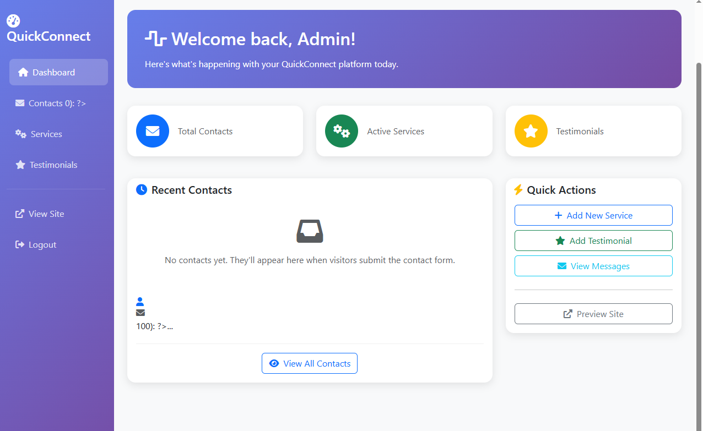

# QuickConnect

QuickConnect is a modern business landing page with an integrated contact management system and admin dashboard. It is built with PHP, MySQL, Bootstrap 5, and JavaScript, providing a professional platform for lead generation, service showcasing, and testimonial management.

## Features

- **Landing Page:** Responsive, SEO-optimized landing page with animated sections.
- **Contact Form:** AJAX-powered contact form with validation and email notifications.
- **Admin Dashboard:** Secure admin panel for managing contacts, services, and testimonials.
- **Service Management:** Add, edit, and organize services with features and pricing.
- **Testimonial Management:** Collect and display client testimonials with ratings.
- **Contact Management:** View, reply, and manage all contact inquiries.
- **Authentication:** Secure admin login with hashed passwords.
- **Modern UI:** Built with Bootstrap 5 and Font Awesome for a clean, modern look.
- **Customizable:** Easily update branding, services, and content.

## Project Structure

```
quickconnect/
│
├── index.php
├── contact_submit.php
├── database.sql
├── config/
│   └── database.php
├── admin/
│   ├── dashboard.php
│   ├── contacts.php
│   ├── services.php
│   ├── testimonials.php
│   ├── login.php
│   ├── logout.php
│   ├── middleware/
│   │   └── auth.php
│   └── logs/
│       └── security.log
├── assets/
│   ├── css/
│   │   └── style.css
│   └── js/
│       └── main.js
└── logs/
    └── error.log
```

## Installation

1. **Clone the repository:**
   ```sh
   git clone https://github.com/yourusername/quickconnect.git
   cd quickconnect
   ```

2. **Set up the database:**
   - Create a MySQL database (e.g., `quickconnect_db`).
   - Import the provided [`database.sql`](database.sql) file to create tables and insert sample data.

3. **Configure database connection:**
   - Edit [`config/database.php`](config/database.php) with your MySQL credentials.

4. **Set file permissions:**
   - Ensure the `logs/` directory is writable by the web server for error logging.

5. **Set up a local server:**
   - Use Apache, Nginx, or PHP's built-in server:
     ```sh
     php -S localhost:8000
     ```

6. **Access the application:**
   - Visit `http://localhost:8000` in your browser.

## Admin Panel

- **Login:** Go to `/admin/login.php`
- **Default Credentials:**
  - Username: `admin`
  - Password: `admin123` (change after first login!)

## Customization

- **Branding:** Update site name, logo, and colors in [`index.php`](index.php) and [`assets/css/style.css`](assets/css/style.css).
- **Services:** Manage via the admin panel or directly in the database.
- **Testimonials:** Add/edit via the admin panel.
- **Contact Email:** Set the recipient email in [`contact_submit.php`](contact_submit.php).

## Security Notes

- Change the default admin password after installation.
- Use HTTPS in production.
- Restrict access to the `admin/` directory as needed.
- Review and update email addresses and SMTP settings for production use.

## Screenshots

> _Add screenshots of the landing page and admin dashboard here._



## License

This project is licensed under the MIT License. See [LICENSE](LICENSE) for details.

## Credits

- [Bootstrap 5](https://getbootstrap.com/)
- [Font Awesome](https://fontawesome.com/)
- Unsplash (demo images)

---

**QuickConnect** - Transform your business online with a professional landing page and integrated
